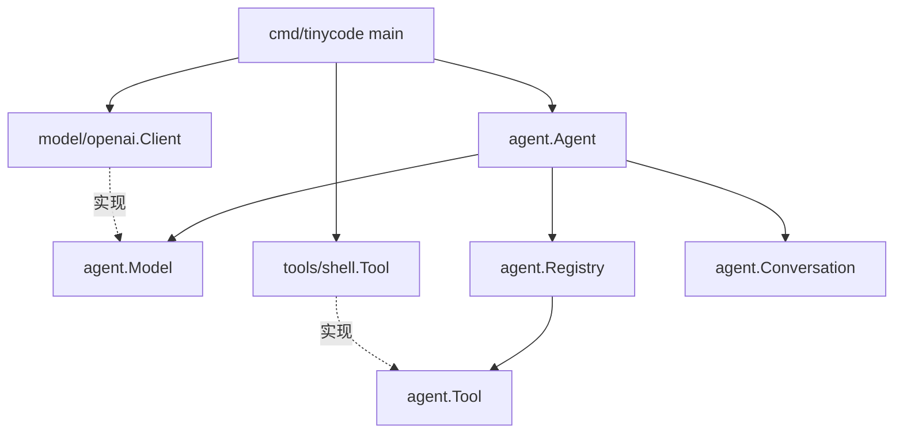
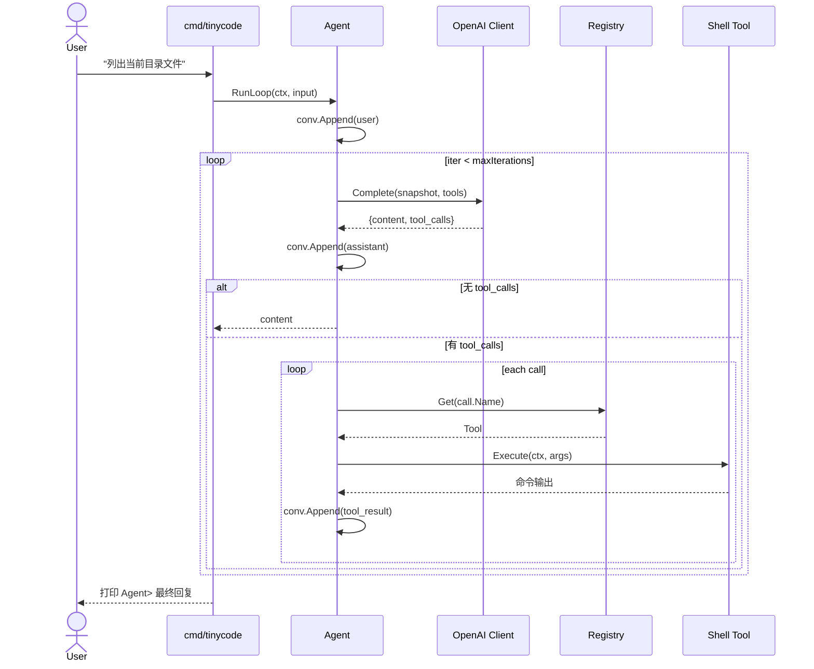

# TinyCode Agent 架构设计与实现说明

> 基于 `one_loop.md` 的 "One Loop is All You Need" 哲学，参考 [blades-main](../.qoder/example/blades-main/) 的分层组织与 [openai/client.go](../.qoder/example/openai/client.go) 的模型接入方式，构建一个最小、可扩展、易读的命令行 Agent。

---

## 1. 设计哲学

### 1.1 Model = 驾驶者，Harness = 载具

`one_loop.md` 反复强调一个核心洞见：Agent 的自主性来自模型的训练，而不是来自 Harness 里的编排代码。本项目严格遵循该原则：

- **Harness 极薄**：`RunLoop` 内没有 if/else 路由、没有状态机、没有"纠偏"逻辑，只有一个 `for + stop_reason` 的结构。
- **模型做决策**：是否调用工具、调用哪个工具、何时结束，完全由模型通过 `tool_calls` / `finish_reason` 自己给出。
- **工具忠实执行**：Shell 工具不会对命令做"聪明的改写"，只做参数校验、黑名单拦截、超时控制、输出截断。

### 1.2 One Loop is All You Need

全部核心逻辑就是一个 `for` 循环（见 [agent.go](../internal/agent/agent.go)）：

```
append(user)
for i < maxIterations:
    resp = model.Complete(messages, tools)
    append(assistant + tool_calls)
    if len(tool_calls) == 0: return resp.content
    for call in tool_calls:
        append(tool_result)
```

### 1.3 messages[] 只追加不修改

`Conversation` 类型严格保证"只追加"不变量（`Append` 是唯一写入口，读取通过 `Snapshot` 返回副本）。这带来三重好处：

1. 模型上下文一致：每次调用看到的历史完全一致；
2. 天然可审计：messages 本身就是完整的执行日志；
3. 简化并发：读者拿到副本，天然线程安全。

---

## 2. 模块划分

```
tinyCode/
├── internal/
│   ├── agent/                     Agent 核心（Harness）
│   │   ├── types.go               中性消息模型：Message / ToolCall / ...
│   │   ├── model.go               Model 接口
│   │   ├── tool.go                Tool 接口 + Registry
│   │   ├── conversation.go        只追加的会话历史
│   │   ├── options.go             Functional Options
│   │   ├── agent.go               RunLoop 主循环
│   │   └── errors.go              可识别错误
│   ├── model/openai/                OpenAI 兼容 API 实现（实现 Model）
│   │   ├── client.go                HTTP 客户端
│   │   └── observer.go              模型交互观测器（可选，默认 Nop）
│   └── tools/shell/                 跨平台 Shell 工具（实现 Tool）
│       ├── shell.go
│       └── blacklist.go
└── docs/DESIGN.md                 本文件
```

### 2.1 模块关系图



注意箭头方向：**一切都指向 `agent` 包定义的抽象接口**；具体实现（OpenAI、Shell）只是可替换的插件。这就是"依赖倒置"在本项目中的落地。

---

## 3. 核心数据流

### 3.1 一次用户输入的完整时序



### 3.2 消息角色映射

| 角色 (role)       | 产出者       | 含义                                | 是否可包含 tool_calls | 是否需要 tool_call_id |
|--------------------|-------------|------------------------------------|:--------------------:|:---------------------:|
| `system`          | 框架         | 系统提示，只放在 OpenAI messages 第一项 | 否                    | 否                   |
| `user`            | REPL 输入    | 用户消息                              | 否                    | 否                   |
| `assistant`       | 模型         | 模型回复（可能同时包含 tool_calls）     | 是                    | 否                   |
| `tool`            | Agent        | 工具执行结果，关联某次 tool_call      | 否                    | 是                   |

---

## 4. 关键接口

### 4.1 Model

```go
type Model interface {
    Name() string
    Complete(ctx context.Context, req CompletionRequest) (CompletionResponse, error)
}
```

任何大模型（OpenAI / Azure OpenAI / Ollama / 国内兼容网关 / Anthropic 适配器）只要实现该接口即可接入。新增一个 Model 实现的步骤：

1. 新建 `internal/model/<provider>/client.go`；
2. 实现 `Name()` 与 `Complete()`；
3. 在 `cmd/tinycode/main.go` 中替换 `openai.NewClient(...)` 为新 Client 即可。

> 🔍 **可选观测能力**：OpenAI 实现提供了可插拔的 `Observer` 接口与 `JSONLFileObserver` 默认落盘实现（默认 `NopObserver` 零开销）。由 `bootstrap` 根据 `cfg.Trace` 开关注入 `openai.WithObserver(...)`，不侵入 `Model` 接口、不污染 Agent 主环。详见 [TECHNICAL.md § 3.2.4](./TECHNICAL.md)。

### 4.2 Tool

```go
type Tool interface {
    Name() string
    Description() string
    Parameters() json.RawMessage  // JSON Schema
    Execute(ctx context.Context, input json.RawMessage) (string, error)
}
```

新增工具的步骤：

1. 新建 `internal/tools/<name>/tool.go`；
2. 实现四个方法，Parameters 返回 JSON Schema；
3. 在 `cmd/tinycode/main.go` 里通过 `agent.WithTools(mytool.New(...))` 注册；

不需要修改任何核心代码。

---

## 5. 安全考虑

### 5.1 黑名单

`internal/tools/shell/blacklist.go` 维护跨平台黑名单（大小写不敏感的子串匹配）：

- Unix 侧：`rm -rf /`、`mkfs`、`shutdown`、`dd if=`、`chmod 777`、`sudo su` ...
- Windows 侧：`Remove-Item -Recurse -Force`、`Format-Volume`、`Stop-Computer` ...
- 版本控制：`git push --force`、`git reset --hard` ...

命中规则时 **不返回 Go error**，而是给模型返回一条"被拦截"的文本提示，让它尝试更小范围的操作——这与 one_loop.md "让模型自我修复" 的思路一致。

### 5.2 超时

每次 Execute 都会在调用方 ctx 上用 `context.WithTimeout` 包一层（默认 30 秒，模型可通过 timeout 参数调整）。超时后返回 `[命令超时]` 提示。

### 5.3 输出截断

合并后的 stdout/stderr 超过 50000 字节时做头尾截断，中间替换为 `... [输出已截断，中间省略] ...`，避免 token 爆炸。

### 5.4 工作目录

Shell 工具的 `workDir` 来自 `os.Getwd()`，所有命令都在该目录下执行，避免"模型意外跳到系统根目录"。

### 5.5 Windows UTF-8 编码处理

中文 Windows 的 PowerShell 默认以 CP936（GBK）输出到管道，Go 侧以 UTF-8 解读会得到乱码。Shell 工具在用户命令前自动插入三条前置语句：

1. `chcp 65001` 切换控制台代码页；
2. `[Console]::OutputEncoding` 控制 PowerShell 写回标准输出时的编码；
3. `$OutputEncoding` 控制通过管道传给其他程序时的编码。

三者合起来保证 `CombinedOutput` 读到的始终是 UTF-8。

---

## 6. 对齐 blades-main 的工程实践

| 特性                  | 做法                                                       | 对应 blades-main       |
|----------------------|-----------------------------------------------------------|------------------------|
| Functional Options   | `agent.WithModel/WithTools/WithMaxIterations/...`          | `agent.go: AgentOption`|
| 接口抽象              | `Model` / `Tool` 与具体实现彻底解耦                         | `ModelProvider`、`tools.Tool`|
| 迭代上限防御          | `maxIterations + ErrMaxIterationsExceeded`                | `ErrMaxIterationsExceeded`|
| 只追加的会话          | `Conversation.Append / Snapshot`                           | `session.Append / History`|
| 编译期接口断言        | `var _ agent.Tool = (*Tool)(nil)`                          | 常见 Go idiom          |

我们有意 **没有** 引入 blades-main 更重型的部件（middleware chain、graph executor、skills toolset、streaming、resume），因为它们超出"最小 Agent"的范围。这些能力都可以在现有抽象上顺势扩展，不需要推翻重来。

---

## 7. 已知局限与后续演进

| 局限                         | 说明                                                     | 演进方向                                         | 状态 |
|-----------------------------|---------------------------------------------------------|-------------------------------------------------|------|
| 不支持流式响应               | `Complete` 是一次性返回                                   | 在 `Model` 接口新增 `Stream` 方法，Agent 做增量渲染| 待实现 |
| 无会话压缩                   | 长对话会把历史全量发给模型                                 | 参考 blades-main `context/summary` 做滚动压缩      | 待实现 |
| 工具顺序执行                 | 同一轮多个 tool_calls 顺序跑                              | 在 `executeTool` 用 `errgroup` 并发               | 待实现 |
| 黑名单基于子串               | 无法表达"禁止 rm -rf 但允许 rm 单个文件"                    | 升级为正则 / AST 级规则引擎                        | 待实现 |
| 无中间件                    | 日志/重试/审批硬编码                                      | 参考 blades-main `middleware` 模式做链式包装        | 待实现 |
| 单工具                     | 仅 Shell                                                | 新增 read_file / write_file / http 等（接口已就绪）  | 待实现 |
| ~~REPL 单线程~~             | ~~长命令期间无法接收新输入~~                               | ~~引入 tview / readline 做全屏交互~~               | ✅ **TUI 已实现**：基于 Bubble Tea 的全屏交互界面，支持异步运行与实时事件气泡 |
| ~~无配置系统~~              | ~~仅支持环境变量~~                                        | ~~引入配置文件与四层优先级合并~~                    | ✅ **已实现**：`config.yaml` + flag/env/file/default 四层合并 |
| ~~无观测能力~~              | ~~无法排查模型交互故障~~                                   | ~~引入 HTTP 请求/响应 JSONL 日志~~                 | ✅ **已实现**：内置 `JSONLFileObserver`，支持懒创建、脱敏、降级 stderr |
| ~~无 CLI 框架~~             | ~~纯 `bufio.Scanner` 入口~~                               | ~~引入 Cobra 命令树与 PersistentFlags~~            | ✅ **已实现**：Cobra 三节点结构（root / repl / version） |
| ~~无对象装配工厂~~          | ~~main.go 直接构造依赖~~                                   | ~~引入 bootstrap 集中装配~~                        | ✅ **已实现**：`bootstrap.Build` 统一装配 Agent、Model、Tool、Observer |

---

## 8. 快速开始

### 8.1 环境变量

| 变量              | 必需 | 默认值                              |
|------------------|:---:|-------------------------------------|
| `OPENAI_API_KEY` | 是  | —                                   |
| `OPENAI_BASE_URL`| 否  | `https://api.openai.com/v1`         |
| `OPENAI_MODEL`   | 否  | `gpt-4o-mini`                       |

### 8.2 运行

PowerShell：

```powershell
$env:OPENAI_API_KEY = "sk-..."
$env:OPENAI_MODEL   = "gpt-4o-mini"   # 可选
go run ./cmd/tinycode
```

Bash：

```bash
export OPENAI_API_KEY=sk-...
go run ./cmd/tinycode
```

### 8.3 示例会话

```
===================================
 TinyCode Agent (one-loop minimal)
===================================
模型: gpt-4o-mini
工作目录: D:\workspace\go-project\tinyCode
输入 quit / exit / :q 退出。

你> 列出当前目录下的 Go 文件
[agent] loop.iter [n 1]
[agent] tool.exec [name shell id call_xxx]
[agent] loop.iter [n 2]
[agent] loop.done [content_len 128]

Agent> 当前目录下共有以下 Go 文件：
- cmd/tinycode/main.go
- internal/agent/agent.go
- ...
```

---

## 9. 文件清单

| 文件                                        | 职责                                  |
|--------------------------------------------|---------------------------------------|
| [go.mod](../go.mod)                        | 模块定义                                |
| [cmd/tinycode/main.go](../cmd/tinycode/main.go) | CLI 入口：构造 root 命令并驱动 Execute |
| [internal/agent/types.go](../internal/agent/types.go) | 中性消息模型                    |
| [internal/agent/model.go](../internal/agent/model.go) | Model 接口                      |
| [internal/agent/tool.go](../internal/agent/tool.go)   | Tool 接口 + Registry            |
| [internal/agent/conversation.go](../internal/agent/conversation.go) | 只追加会话       |
| [internal/agent/options.go](../internal/agent/options.go) | Functional Options        |
| [internal/agent/agent.go](../internal/agent/agent.go) | RunLoop 主循环                  |
| [internal/agent/errors.go](../internal/agent/errors.go) | 可识别错误                    |
| [internal/model/openai/client.go](../internal/model/openai/client.go) | OpenAI 客户端 |
| [internal/model/openai/observer.go](../internal/model/openai/observer.go) | 模型交互观测器（JSONL 日志） |
| [internal/tools/shell/shell.go](../internal/tools/shell/shell.go) | Shell 工具     |
| [internal/tools/shell/blacklist.go](../internal/tools/shell/blacklist.go) | 黑名单 |
| [internal/cli/root.go](../internal/cli/root.go) | Cobra 根命令（默认进入 TUI） |
| [internal/cli/repl_cmd.go](../internal/cli/repl_cmd.go) | `repl` 子命令 |
| [internal/cli/version_cmd.go](../internal/cli/version_cmd.go) | `version` 子命令 |
| [internal/cli/config/config.go](../internal/cli/config/config.go) | 四层配置优先级合并（flag/env/file/default） |
| [internal/cli/config/config_test.go](../internal/cli/config/config_test.go) | 配置合并单元测试 |
| [internal/cli/config/file.go](../internal/cli/config/file.go) | `config.yaml` 最小 YAML 解析器 |
| [internal/cli/config/file_test.go](../internal/cli/config/file_test.go) | YAML 解析单元测试 |
| [internal/cli/bootstrap/bootstrap.go](../internal/cli/bootstrap/bootstrap.go) | Agent 装配工厂 |
| [internal/ui/repl/repl.go](../internal/ui/repl/repl.go) | 纯文本 REPL 实现 |
| [internal/ui/tui/program.go](../internal/ui/tui/program.go) | TUI 程序入口与启动 |
| [internal/ui/tui/model.go](../internal/ui/tui/model.go) | TUI 状态定义（MVU Model） |
| [internal/ui/tui/update.go](../internal/ui/tui/update.go) | TUI 消息路由与状态更新 |
| [internal/ui/tui/view.go](../internal/ui/tui/view.go) | TUI 界面渲染 |
| [internal/ui/tui/runner.go](../internal/ui/tui/runner.go) | TUI 异步任务包装 |
| [internal/ui/tui/events.go](../internal/ui/tui/events.go) | TUI channelSink 事件消费 |
| [internal/ui/tui/styles.go](../internal/ui/tui/styles.go) | TUI Lipgloss 样式定义 |
| [internal/ui/tui/keys.go](../internal/ui/tui/keys.go) | TUI 快捷键绑定 |
