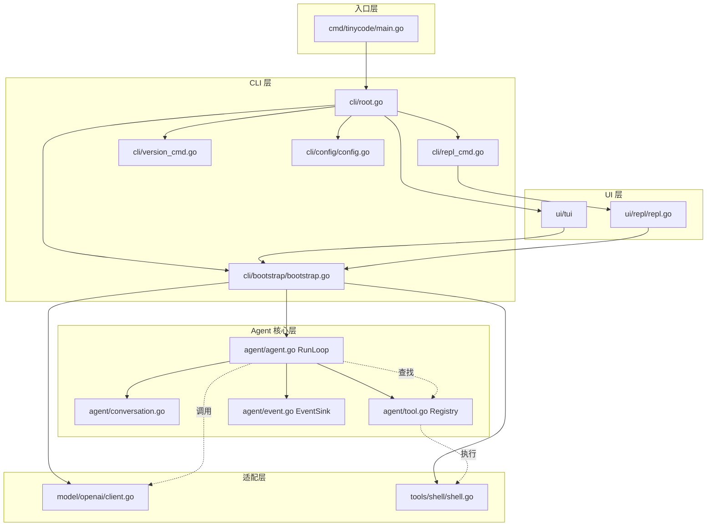
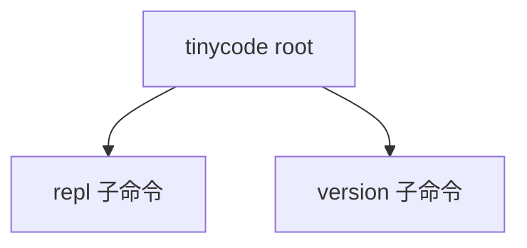
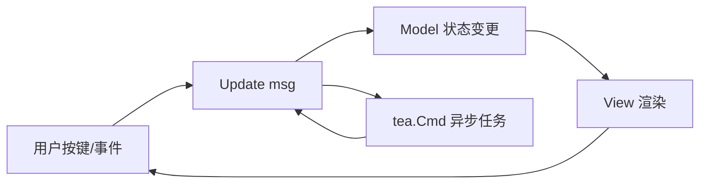

# tinyCode 技术实现详解

> 本文档从源码层面拆解 tinyCode 的每一层设计决策，带你读懂"一个最小可用 Coding Agent"是如何从第一行代码生长出来的。

---

## 1. 项目概述

### 1.1 tinyCode 是什么

tinyCode 是一个**最小可用的 A tiny Coding Agent**。它的核心使命很简单：让大模型在本地终端里"活"起来——用户输入一句话，Agent 自动决定是否需要调用工具（比如执行 shell 命令），再把结果汇总成最终回复。

它解决的痛点是：大多数 Agent 框架为了"可扩展"而变得臃肿，中间件链、图执行器、插件系统层层叠加，反而让人看不清"模型到底做了什么"。tinyCode 反其道而行，用不到 1500 行代码证明：**一个 for 循环 + 两个接口，足以支撑 90% 的编程助手场景。**

### 1.2 技术栈概览

| 技术/库 | 版本 | 用途 |
|---------|------|------|
| Go | 1.25 | 全栈语言，零运行时依赖 |
| Cobra | v1.10.2 | CLI 命令树与参数解析 |
| Bubble Tea | v1.3.10 | 交互式终端 TUI |
| Lipgloss | v1.1.0 | 终端样式渲染 |
| OpenAI API | 兼容端点 | 大模型对话与工具调用 |

### 1.3 项目目录结构

```
tinyCode/
├── cmd/
│   └── tinycode/main.go       # 入口：极简，只构造 root 命令
├── internal/
│   ├── agent/                 # Agent 核心引擎
│   │   ├── types.go           # 中性消息模型（Message / ToolCall）
│   │   ├── model.go           # Model 接口：大模型最小契约
│   │   ├── tool.go            # Tool 接口 + Registry 注册表
│   │   ├── conversation.go    # 只追加的会话历史
│   │   ├── agent.go           # RunLoop 主循环
│   │   ├── options.go         # Functional Options 装配
│   │   ├── event.go           # 结构化事件协议
│   │   └── errors.go          # 可识别错误类型
│   ├── model/openai/
│   │   ├── client.go          # OpenAI 兼容 HTTP 客户端
│   │   └── observer.go        # 模型交互观测器（JSONL 落盘 + 脱敏）
│   ├── tools/shell/
│   │   ├── shell.go           # 跨平台 Shell 工具
│   │   └── blacklist.go       # 危险命令黑名单
│   ├── cli/
│   │   ├── root.go            # Cobra 根命令
│   │   ├── repl_cmd.go        # repl 子命令
│   │   ├── version_cmd.go     # version 子命令
│   │   ├── config/
│   │   │   ├── config.go      # 四层配置优先级合并（flag/env/file/default）
│   │   │   └── file.go        # config.yaml 最小 YAML 解析器
│   │   └── bootstrap/bootstrap.go # Agent 装配工厂
│   └── ui/
│       ├── repl/repl.go       # 纯文本 REPL
│       └── tui/               # Bubble Tea TUI（7 文件拆分）
│           ├── program.go
│           ├── model.go
│           ├── update.go
│           ├── view.go
│           ├── runner.go
│           ├── events.go
│           ├── styles.go
│           └── keys.go
└── docs/
    ├── DESIGN.md              # 架构设计文档
    ├── PLAN.md                # 实现计划
    └── TECHNICAL.md           # 本文件
```

---

## 2. 架构总览

### 2.1 分层架构

tinyCode 采用清晰的分层架构，每一层只向下依赖一层，通过接口而非具体实现交互。



### 2.2 各层职责

| 层级 | 职责 | 核心设计原则 |
|------|------|-------------|
| **cmd** | 程序入口，保持极简 | 只构造命令、驱动 Execute，零业务逻辑 |
| **cli** | 命令树、配置解析、对象装配 | Cobra 管路由，bootstrap 管装配，职责分离 |
| **agent** | Agent 引擎：RunLoop、会话、工具注册、事件 | Harness 尽量薄，模型做决策 |
| **model/tools** | 大模型与工具的具体实现 | 通过接口接入，可替换 |
| **ui** | 用户交互层：TUI / REPL | 消费事件而非侵入 Agent |

---

## 3. 核心模块详解

### 3.1 Agent 引擎（`internal/agent/`）

Agent 包是整个项目的"心脏"。它遵循 `one_loop.md` 的核心哲学：**Harness 尽量薄，模型做决策。**

#### 3.1.1 Agent 生命周期

一个 Agent 从创建到运行的生命周期只有三步：

```go
// 1. 创建：通过 Functional Options 装配
agent, err := agent.NewAgent(
    agent.WithModel(client),           // 注入大模型（唯一必填）
    agent.WithTools(shellTool),        // 注册工具
    agent.WithMaxIterations(20),       // 安全阀
    agent.WithEventSink(sink),         // 注入事件订阅者
)

// 2. 配置：Registry 可动态追加工具
agent.Registry().Register(myTool)

// 3. 运行：一次用户输入 = 一次 RunLoop
reply, err := agent.RunLoop(ctx, "列出当前目录文件")
```

为什么用 Option 模式而不是构造函数传参？因为 Agent 的字段会随需求演进（比如后续要加 `temperature`、`topP`），如果用固定参数列表，每次新增字段都会破坏所有调用方。Option 模式让"新增能力"变成"新增一个 WithXxx 函数"，调用方无感知。

#### 3.1.2 RunLoop 核心流程

`RunLoop` 是整个项目最核心的函数，不到 70 行代码，却支撑了 Agent 的全部智能：

```go
func (a *Agent) RunLoop(ctx context.Context, userInput string) (string, error) {
    a.conv.Append(Message{Role: RoleUser, Content: userInput})

    for i := 0; i < a.maxIterations; i++ {
        iter := i + 1
        a.sink.Emit(Event{Kind: EventIterStart, Iter: iter})

        // 1) 调用大模型
        resp, err := a.model.Complete(ctx, CompletionRequest{
            SystemPrompt: a.systemPrompt,
            Messages:     a.conv.Snapshot(),
            Tools:        a.registry.Definitions(),
        })
        if err != nil {
            // ... 错误处理，发送事件后返回
        }

        // 2) 把模型响应追加到会话历史
        a.conv.Append(Message{
            Role:      RoleAssistant,
            Content:   resp.Message.Content,
            ToolCalls: resp.ToolCalls,
        })

        // 3) 没有 tool_calls → 任务完成，直接返回
        if len(resp.ToolCalls) == 0 {
            a.sink.Emit(Event{Kind: EventDone, Iter: iter, Payload: resp.Message.Content})
            return resp.Message.Content, nil
        }

        // 4) 有 tool_calls → 逐个执行，结果追加为 role=tool 消息
        for _, call := range resp.ToolCalls {
            output := a.executeTool(ctx, call)
            a.conv.Append(Message{
                Role:       RoleTool,
                ToolCallID: call.ID,
                Content:    output,
            })
        }
    }

    return "", ErrMaxIterations
}
```

这个循环的精妙之处在于**零编排逻辑**：没有"如果模型说了 A 就执行 B"的判断，没有状态机，没有硬编码的分支。模型通过 `tool_calls` 表达意图，Agent 只做"忠实的信使"——转发请求、回写结果。

`maxIterations` 是一个安全阀。如果模型陷入"调用工具 → 看到结果 → 再调用工具"的死循环，20 轮后会强制退出并返回 `ErrMaxIterations`，避免无限消耗 Token。

#### 3.1.3 Conversation 会话管理

`Conversation` 的设计只有一个铁律：**messages 数组只追加，永远不修改已有元素。**

```go
type Conversation struct {
    mu       sync.RWMutex
    messages []Message
}

func (c *Conversation) Append(m Message) int {
    c.mu.Lock()
    defer c.mu.Unlock()
    c.messages = append(c.messages, m)
    return len(c.messages)
}

func (c *Conversation) Snapshot() []Message {
    c.mu.RLock()
    defer c.mu.RUnlock()
    out := make([]Message, len(c.messages))
    copy(out, c.messages)
    return out
}
```

这条铁律带来三重好处：

1. **模型上下文一致性**：每次 `model.Complete` 看到的 `Snapshot()` 都是一份完整副本，不存在"读到一半被修改"的竞态条件。
2. **天然可审计**：`messages` 本身就是一条完整的执行日志，出了问题可以逐轮回溯。
3. **简化并发**：读者（UI、日志）和写者（RunLoop）之间不需要复杂的锁协议，一个 `RWMutex` 足够。

#### 3.1.4 Registry 工具注册表

`Registry` 是一个带并发保护的 dispatch map，同时负责两件事：运行时查找工具、生成发给模型的工具清单。

```go
type Registry struct {
    mu    sync.RWMutex
    tools map[string]Tool
    order []string // 保留注册顺序，生成 Definitions 时稳定输出
}

func (r *Registry) Register(t Tool) {
    r.mu.Lock()
    defer r.mu.Unlock()
    name := t.Name()
    if _, ok := r.tools[name]; !ok {
        r.order = append(r.order, name)
    }
    r.tools[name] = t
}

func (r *Registry) Definitions() []ToolDefinition {
    r.mu.RLock()
    defer r.mu.RUnlock()
    defs := make([]ToolDefinition, 0, len(r.order))
    for _, name := range r.order {
        defs = append(defs, ToolDefinition{...})
    }
    return defs
}
```

为什么要单独维护 `order` 数组？因为 Go 的 `map` 遍历顺序是随机的。如果不保留顺序，每次 `Definitions()` 返回的工具列表顺序都不同，可能导致模型对工具的"注意力"产生微妙波动。虽然大模型对顺序不敏感，但**可重复性**是工程严谨性的体现。

#### 3.1.5 事件系统 EventSink

Agent 内部的状态变化（开始一轮循环、收到模型回复、执行工具、出错）需要通过某种方式告知外部（TUI、日志、监控）。tinyCode 采用**结构化事件协议**而非回调函数：

```go
type EventKind string

const (
    EventIterStart      EventKind = "iter.start"
    EventAssistantReply EventKind = "assistant.reply"
    EventToolCall       EventKind = "tool.call"
    EventToolResult     EventKind = "tool.result"
    EventError          EventKind = "error"
    EventDone           EventKind = "done"
)

type Event struct {
    Kind       EventKind
    Iter       int
    ToolName   string
    ToolCallID string
    Payload    string
    Args       json.RawMessage
}

type EventSink interface {
    Emit(Event)
}
```

设计上有两个关键取舍：

- **事件是扁平的值对象，不含 UI 语义**：TUI 可以把它渲染成气泡，REPL 可以打印成日志，监控系统可以打成指标——同一份事件，多种消费方式。
- **EventSink 与 Logger 并存**：`WithLogger` 输出人类可读文本（调试用），`WithEventSink` 输出结构化事件（UI/监控用），两者互不干扰。

默认实现 `noopSink` 避免了 nil 判断的繁琐：

```go
type noopSink struct{}
func (noopSink) Emit(Event) {}
```

---

### 3.2 模型集成（`internal/model/openai/`）

#### 3.2.1 OpenAI Client 实现

`Client` 实现了 `agent.Model` 接口，封装了 OpenAI Chat Completions 协议的全部细节：

```go
type Client struct {
    baseURL    string
    apiKey     string
    model      string
    httpClient *http.Client
    temp       float64 // 默认 0.1，追求稳定输出
}

func (c *Client) Complete(ctx context.Context, req agent.CompletionRequest) (agent.CompletionResponse, error) {
    // 1) 组装请求体
    payload := map[string]any{
        "model":       c.model,
        "temperature": c.temp,
        "messages":    toOpenAIMessages(req.SystemPrompt, req.Messages),
    }
    if tools := toOpenAITools(req.Tools); len(tools) > 0 {
        payload["tools"] = tools
        payload["tool_choice"] = "auto"
    }

    // 2) 发送 HTTP POST
    // 3) 解析响应中的 choices[0].message
    // 4) 还原 tool_calls（注意 arguments 是字符串化 JSON，需再解析一次）
}
```

这里有两个值得细品的工程决策：

**温度设为 0.1**：Coding Agent 需要的是确定性而非创造性。温度越低，模型输出越稳定，重复执行同一命令的结果越可预期。

**空工具列表时不发 tools 字段**：某些 OpenAI 兼容实现（比如自建网关）对空 `tools` 数组处理不严谨，干脆在工具为空时省略该字段，避免踩坑。

#### 3.2.2 消息格式转换

Agent 层的 `Message` 是"中性"的，不绑定任何具体协议。`toOpenAIMessages` 负责在边界处做格式转换：

```go
func toOpenAIMessages(systemPrompt string, messages []agent.Message) []map[string]any {
    result := make([]map[string]any, 0, len(messages)+1)
    if systemPrompt != "" {
        result = append(result, map[string]any{
            "role": "system", "content": systemPrompt,
        })
    }
    for _, m := range messages {
        item := map[string]any{"role": m.Role, "content": m.Content}
        if m.ToolCallID != "" {
            item["tool_call_id"] = m.ToolCallID
        }
        if len(m.ToolCalls) > 0 {
            item["tool_calls"] = toOpenAIToolCalls(m.ToolCalls)
        }
        result = append(result, item)
    }
    return result
}
```

OpenAI 要求 `system` 消息必须放在数组第一项，且 `tool` 消息必须带 `tool_call_id`。这些协议细节被完全封装在 `openai` 包内，Agent 层对此一无所知——**这就是"依赖倒置"的力量**：Agent 依赖抽象接口，OpenAI 客户端负责实现细节。

#### 3.2.3 Option 模式配置

客户端也使用 Option 模式，与 Agent 层风格一致：

```go
type Option func(*Client)

func WithHTTPClient(hc *http.Client) Option {
    return func(c *Client) { c.httpClient = hc }
}

func WithTemperature(t float64) Option {
    return func(c *Client) { c.temp = t }
}
```

这种一致性不是偶然的。当一个项目里到处都用 Option 模式时，新成员只需要理解一次"函数选项"的概念，就能读懂所有构造逻辑。

#### 3.2.4 模型交互观测器

与大模型 API 交互时最常见的故障（400 / 500 / 超时 / 格式不匹配）都发生在 HTTP 边界。为了让排查不再靠猜，`openai` 包提供了一个 **可插拔的观测器** （`observer.go`）：

```go
type Observer interface {
    OnRequest(url string, headers http.Header, payload []byte)
    OnResponse(status int, body []byte, duration time.Duration)
    OnError(err error, duration time.Duration)
}
```

- **默认 NopObserver**：内置空实现，不开启时 Client 零额外开销；
- **默认提供 JSONLFileObserver**：将每次交互以一行 JSON 的形式追加到文件，一次运行一个 `openai-YYYYMMDD-HHMMSS.jsonl`；
- **自动脱敏**：`Authorization` / `X-API-Key` 等请求头写入前替换为 `***redacted***`；
- **降级写入**：写盘失败时打到 stderr，绝不阻塞主流程。

在 Client.Complete 中有三个钩子点：

```go
c.observer.OnRequest(httpReq.URL.String(), httpReq.Header, body)
start := time.Now()

resp, err := c.httpClient.Do(httpReq)
if err != nil {
    c.observer.OnError(err, time.Since(start))
    return ..., err
}

respBody, _ := io.ReadAll(resp.Body)
c.observer.OnResponse(resp.StatusCode, respBody, time.Since(start))
```

注意响应钩子放在状态码判断 **之前**：非 2xx 时也能完整记录上游返回的错误体，这正是排查 400/500 问题时最需要的证据。

开关通过 `RuntimeConfig.Trace` 控制，bootstrap 在为真时构造 `JSONLFileObserver` 并通过 `openai.WithObserver` 注入。UI 层只需负责退出前关闭文件句柄（见 4.3）。

---

### 3.3 工具系统（`internal/tools/shell/`）

#### 3.3.1 Shell 工具实现

Shell 工具是 tinyCode 目前唯一内置的工具，但它证明了"一个工具足以让模型完成绝大多数编程任务"。

```go
func (t *Tool) Execute(ctx context.Context, raw json.RawMessage) (string, error) {
    // 1. 参数反序列化
    var input Input
    if err := json.Unmarshal(raw, &input); err != nil { ... }

    // 2. 黑名单拦截
    if reason, blocked := t.isBlocked(input.Command); blocked {
        return fmt.Sprintf("命令被安全策略拦截：%s", reason), nil
    }

    // 3. 应用超时
    execCtx, cancel := context.WithTimeout(ctx, timeout)
    defer cancel()

    // 4. 根据 OS 选择解释器
    name, args := pickShell(input.Command)
    cmd := exec.CommandContext(execCtx, name, args...)

    // 5. 合并 stdout/stderr 并截断超长输出
    output, runErr := cmd.CombinedOutput()
    result := string(output)
    if len(result) > maxOutputBytes { ... }

    // 6. 错误信息拼入输出，不返回 Go error
    if runErr != nil {
        return fmt.Sprintf("%s\n[退出码/错误: %v]", result, runErr), nil
    }
    return result, nil
}
```

第 6 步是一个关键设计：**命令执行失败（非 0 退出码）不返回 Go error，而是把错误信息贴到输出末尾。** 这样模型能在下一轮看到"命令报错了"，并自行决定修复方案。如果返回 error，RunLoop 会中断，Agent 就失去了"自我修复"的机会。

#### 3.3.2 安全控制：命令黑名单

黑名单采用**子串匹配**而非精确匹配，覆盖常见变体：

```go
func defaultBlacklist() []string {
    return []string{
        "rm -rf /", "mkfs", "> /dev/sda",
        "git push --force", "git reset --hard",
        "remove-item -recurse -force", "format-volume",
    }
}

func (t *Tool) isBlocked(command string) (string, bool) {
    cmdLower := strings.ToLower(strings.TrimSpace(command))
    for _, pattern := range t.blacklist {
        if strings.Contains(cmdLower, strings.ToLower(pattern)) {
            return fmt.Sprintf("命中黑名单规则 %q", pattern), true
        }
    }
    return "", false
}
```

命中黑名单时，同样**不返回 error**，而是给模型返回一段文本提示："命令被安全策略拦截，请尝试更小范围的命令。" 这让模型有机会换一种方式继续尝试，而不是让对话戛然而止。

#### 3.3.3 输出截断策略

```go
const maxOutputBytes = 50000

if len(result) > maxOutputBytes {
    half := maxOutputBytes / 2
    result = result[:half] +
        "\n\n... [输出已截断，中间省略] ...\n\n" +
        result[len(result)-half:]
}
```

头尾保留、中间省略的策略有其深意：工具输出的**开头**通常是命令本身或摘要，**结尾**通常是结论或错误信息，中间往往是冗长的过程日志。截断中间，既能控制 Token 消耗，又不丢失关键上下文。

---

## 4. CLI 与 TUI 架构

### 4.1 Cobra 命令树

tinyCode 的 CLI 入口采用经典的 Cobra 三节点结构：



```go
func NewRootCmd() *cobra.Command {
    cfg := &config.RuntimeConfig{}

    cmd := &cobra.Command{
        Use:   "tinycode",
        Short: "最小可用的 A tiny Coding Agent",
        RunE: func(cmd *cobra.Command, args []string) error {
            if err := cfg.Finalize(cmd.Flags()); err != nil { return err }
            return tui.Run(cmd.Context(), *cfg)
        },
    }

    config.BindFlags(cmd.PersistentFlags(), cfg)
    cmd.AddCommand(newReplCmd(cfg))
    cmd.AddCommand(newVersionCmd())
    return cmd
}
```

三个关键设计点：

- **root 默认进入 TUI**：不带子命令时启动交互式界面，符合现代 CLI 直觉。
- **PersistentFlags 共享配置**：`--api-key`、`--model` 等参数在 root 上定义一次，所有子命令自动继承。
- **SilenceUsage = true**：出错时不重复打印 help 信息，避免污染终端输出。

### 4.2 配置管理

#### 4.2.1 四层优先级机制

`BindFlags` 只注册 flag 与内置默认值；环境变量与 `config.yaml` 的合并统一在 `Finalize` 阶段完成，避免 `pflag.Changed()` 无法区分"环境变量填充"和"用户显式 flag"两种情况。

```go
func BindFlags(fs *pflag.FlagSet, cfg *RuntimeConfig) {
    fs.StringVar(&cfg.BaseURL, "base-url", DefaultBaseURL,
        "OpenAI 兼容 API 的 base URL")
    fs.StringVar(&cfg.Model, "model", DefaultModel,
        "模型名称")
    fs.StringVar(&cfg.APIKey, "api-key", "",
        "API Key；不填则依次读取环境变量 / 配置文件")
    fs.StringVar(&cfg.ConfigPath, "config", DefaultConfigPath,
        "YAML 配置文件路径；文件不存在将被忽略")
    // ... 其余 flag
}
```

优先级顺序：**CLI Flag > 环境变量 > `config.yaml` > 默认值**。

- 用户显式传 `--model gpt-4o` → 用 flag 值；
- 未传 flag 但设置了 `OPENAI_MODEL=gpt-4o-mini` → 用环境变量；
- 前两者都没有，`config.yaml` 中 `model: foo-bar` → 用文件值；
- 以上都无 → 用 `DefaultModel = "gpt-4o-mini"`。

合并粘合剂是一个小巧的 `applyStringOverride`：

```go
// 1. flag 被用户显式改过 → 保留 target；
// 2. env 非空 → env 覆盖；
// 3. 文件值非空 → 文件覆盖；
// 4. 否则保留 BindFlags 写入的默认值。
func applyStringOverride(fs *pflag.FlagSet, name string, target *string, envVal, fileVal string) {
    if fs != nil && fs.Changed(name) { return }
    if envVal != ""  { *target = envVal; return }
    if fileVal != "" { *target = fileVal; return }
}
```

> 目前只有 `api_key` / `base_url` / `model` 三项进入配置文件；`work_dir`、`max_iter` 等仍只接受 flag 或环境变量。

#### 4.2.2 RuntimeConfig 与 Finalize 合并流程

```go
type RuntimeConfig struct {
    APIKey        string // 必填（可来自 flag/env/file）
    BaseURL       string // 默认 https://api.openai.com/v1
    Model         string // 默认 gpt-4o-mini
    WorkDir       string // Shell 工作目录
    MaxIterations int    // 默认 25
    SystemPrompt  string // 覆盖默认提示
    Verbose       bool   // 详细日志
    ConfigPath    string // YAML 配置文件路径；不存在则忽略
}

func (c *RuntimeConfig) Finalize(fs *pflag.FlagSet) error {
    // 1) 读取配置文件（文件不存在时返回空 FileConfig + nil）
    file, err := LoadFile(c.ConfigPath)
    if err != nil && !errors.Is(err, os.ErrNotExist) {
        return fmt.Errorf("读取配置文件失败: %w", err)
    }

    // 2) 三个字段按 flag > env > file > default 合并
    applyStringOverride(fs, "api-key",  &c.APIKey,  os.Getenv(EnvAPIKey),  file.APIKey)
    applyStringOverride(fs, "base-url", &c.BaseURL, os.Getenv(EnvBaseURL), file.BaseURL)
    applyStringOverride(fs, "model",    &c.Model,  os.Getenv(EnvModel),   file.Model)

    // 3) 校验与补全
    if strings.TrimSpace(c.APIKey) == "" {
        return fmt.Errorf(
            "缺少 API Key，请通过 --api-key、环境变量 %s 或配置文件 %s 提供",
            EnvAPIKey, c.effectiveConfigPath())
    }
    if c.WorkDir == "" {
        wd, err := os.Getwd()
        if err != nil { return fmt.Errorf("获取工作目录失败: %w", err) }
        c.WorkDir = wd
    }
    if c.MaxIterations <= 0 {
        c.MaxIterations = DefaultMaxIterations
    }
    return nil
}
```

为什么 `Finalize` 需要接收 `*pflag.FlagSet`？因为只有 FlagSet 才知道某个 flag 是"用户显式写了"还是"取的默认值"。拿到这个信号，才能精准表达"flag 最高优先级，但没传 flag 时应回退到环境变量"的语义。

为什么要把 `LoadFile` 的调用也延后到 `Finalize`？因为 `ConfigPath` 本身也是 flag，必须等 Cobra 把命令行参数解析完才能确定具体路径。把文件读取、环境变量合并、字段校验三步放在同一个入口完成，保持了"一个 RunE 前置处理即装配完成"的单一职责。

### 4.3 Bootstrap 装配

`bootstrap.Build` 是连接"配置"与"对象"的桥梁，也是整个项目唯一的"装配中心"：

```go
func Build(cfg config.RuntimeConfig, opts Options) (*agent.Agent, Artifacts, error) {
    var art Artifacts

    clientOpts := []openai.Option{}
    if cfg.Trace {
        obs, err := openai.NewJSONLFileObserver(cfg.TraceDir)
        if err != nil {
            return nil, art, fmt.Errorf("初始化观测器失败: %w", err)
        }
        clientOpts = append(clientOpts, openai.WithObserver(obs))
        art.TracePath = obs.Path()
        art.TraceCloser = obs
    }
    client := openai.NewClient(cfg.BaseURL, cfg.APIKey, cfg.Model, clientOpts...)

    agentOpts := []agent.Option{
        agent.WithModel(client),
        agent.WithTools(shell.New(cfg.WorkDir)),
        agent.WithMaxIterations(cfg.MaxIterations),
    }
    if cfg.SystemPrompt != "" {
        agentOpts = append(agentOpts, agent.WithSystemPrompt(cfg.SystemPrompt))
    }
    agentOpts = append(agentOpts, opts.ExtraAgentOptions...)

    a, err := agent.NewAgent(agentOpts...)
    if err != nil {
        if art.TraceCloser != nil {
            _ = art.TraceCloser.Close()
        }
        return nil, Artifacts{}, fmt.Errorf("装配 Agent 失败: %w", err)
    }
    return a, art, nil
}

// Artifacts 是 Build 过程中产生的副产品，UI 层按需展示与收尾。
type Artifacts struct {
    TracePath   string    // JSONL 日志绝对路径；未开启时为空
    TraceCloser io.Closer // 文件句柄，需在退出前 Close
}
```

设计意图非常清晰：**UI 层（TUI / REPL）只关心"怎么交互"，不关心"怎么创建对象"；bootstrap 只关心"怎么创建对象"，不关心"谁来使用它"。**

`Options.ExtraAgentOptions` 是一个巧妙的扩展点：TUI 注入 `EventSink`，REPL 注入 `Logger`，而 bootstrap 本身对这两者一无所知。返回的 `Artifacts.TraceCloser` 则用来把观测文件的生命周期管理权交给 UI 层：REPL / TUI 在退出前 `defer art.TraceCloser.Close()` 即可。这就是**依赖注入**的实践——高层模块定义行为，低层模块提供实现。

### 4.4 Bubble Tea TUI

#### 4.4.1 MVU 模式解析

Bubble Tea 采用 **Model-View-Update（MVU）** 架构，与前端框架（如 Elm、React）的思路一脉相承：

| 组件 | 职责 | 对应文件 |
|------|------|---------|
| **Model** | 持有全部状态 | `model.go` |
| **Update** | 接收消息，更新状态 | `update.go` |
| **View** | 根据状态渲染界面 | `view.go` |
| **Cmd** | 产生副作用（IO、定时器） | `runner.go`, `events.go` |



#### 4.4.2 文件拆分策略

TUI 代码被拆分为 7 个文件，每个文件只负责一个维度：

| 文件 | 职责 | 类比前端 |
|------|------|---------|
| `model.go` | 定义 Model 结构体、Init | React 组件的 state + componentDidMount |
| `update.go` | Update 函数、消息路由 | React 的 reducer / setState |
| `view.go` | View 函数、渲染辅助 | JSX 渲染 |
| `runner.go` | RunLoop 的异步包装 | 异步 action creator |
| `events.go` | channelSink、气泡类型 | 事件总线 + 数据模型 |
| `styles.go` | Lipgloss 样式定义 | CSS / styled-components |
| `keys.go` | 快捷键绑定 | 键盘事件映射 |

这种拆分不是形式主义。Bubble Tea 的 `Update` 函数是一个巨大的 switch-case，如果把 View、样式、按键逻辑都塞进去，一个文件很快就会超过 300 行。按维度拆分后，**改样式只看 styles.go，改交互只看 update.go，改布局只看 view.go**——关注点分离到极致。

#### 4.4.3 事件消费：channelSink → waitForEvent → tea.Cmd

TUI 需要实时展示 Agent 的内部事件（"正在调用 shell..."、"工具返回了..."）。但 Bubble Tea 是单线程事件循环，所有状态变更必须通过 `tea.Msg` 流入 `Update`。解决方案是**带缓冲 channel + 线性消费**：

```go
// events.go：channelSink 把 Agent 事件投递到 channel
type channelSink struct {
    ch chan agent.Event
}

func (s *channelSink) Emit(e agent.Event) {
    select {
    case s.ch <- e:   // 正常投递
    default:           // 通道满时丢弃，不阻塞 RunLoop
    }
}

// waitForEvent 生成一个从 channel 读取的 tea.Cmd
func waitForEvent(ch <-chan agent.Event) tea.Cmd {
    return func() tea.Msg {
        e, ok := <-ch
        if !ok { return eventsClosedMsg{} }
        return agentEventMsg(e)
    }
}
```

消费流水线是这样的：

1. `Init()` 启动第一个 `waitForEvent`；
2. 收到事件后，`Update` 处理该事件，然后**立刻返回一个新的 `waitForEvent`**；
3. 如此循环，直到 channel 关闭。

这种"收到一个、挂回一个"的模式，保证了 Bubble Tea 事件循环的**线性消费语义**——不会有并发修改 Model 的风险。

```go
func (m Model) onAgentEvent(e agent.Event) (tea.Model, tea.Cmd) {
    switch e.Kind {
    case agent.EventToolCall:
        m.appendBubble(bubble{kind: bubbleToolCall, ...})
    case agent.EventToolResult:
        m.appendBubble(bubble{kind: bubbleToolResult, ...})
    // ...
    }
    m.refreshViewport()
    return m, waitForEvent(m.sink.Events()) // 挂回监听
}
```

#### 4.4.4 用户交互：Ctrl+C 二段式退出

```go
func (m Model) onKey(msg tea.KeyMsg) (tea.Model, tea.Cmd) {
    switch {
    case keyMatches(msg, m.keys.Cancel): // Ctrl+C
        if m.cancelRun() {
            // busy 状态：取消当前 RunLoop，不退出程序
            m.appendBubble(bubble{kind: bubbleInfo, content: "已请求取消当前对话……"})
            return m, nil
        }
        // 非 busy 状态：退出程序
        return m, tea.Quit
    }
}
```

二段式退出是一个精妙的细节：

- **Agent 正在思考时按 Ctrl+C** → 取消当前对话（`runCancel()`），程序保持运行，用户可以输入新消息；
- **空闲时按 Ctrl+C** → 直接退出程序。

这避免了"误触 Ctrl+C 导致整个程序崩溃"的糟糕体验，也给了用户"中断长耗时操作"的紧急按钮。

---

## 5. 设计模式与原则

### 5.1 Option 模式（函数选项模式）

tinyCode 中几乎所有可配置对象都用 Option 模式构造：

```go
// agent/options.go
type Option func(*Agent)
func WithModel(m Model) Option       { return func(a *Agent) { a.model = m } }
func WithTools(ts ...Tool) Option    { return func(a *Agent) { ... } }
func WithEventSink(s EventSink) Option { return func(a *Agent) { a.sink = s } }

// openai/client.go
type Option func(*Client)
func WithHTTPClient(hc *http.Client) Option { return func(c *Client) { c.httpClient = hc } }
```

**为什么不用结构体传参？** 因为 Option 模式有三个不可替代的优势：

1. **可选参数友好**：调用方只传关心的选项，其余走默认值，不需要记零值语义。
2. **向前兼容**：新增字段 = 新增一个 `WithXxx` 函数，不破坏现有调用方。
3. **惰性求值**：每个 Option 是一个闭包，可以在执行时才决定具体值。

### 5.2 依赖注入通过接口

tinyCode 的核心依赖关系全部通过接口注入：

```go
// agent/model.go
type Model interface {
    Name() string
    Complete(ctx context.Context, req CompletionRequest) (CompletionResponse, error)
}

// agent/tool.go
type Tool interface {
    Name() string
    Description() string
    Parameters() json.RawMessage
    Execute(ctx context.Context, input json.RawMessage) (string, error)
}

// agent/event.go
type EventSink interface {
    Emit(Event)
}
```

**为什么用接口而不是具体类型？**

- 换模型：把 `openai.Client` 换成 `anthropic.Client`，只需实现同样的两个方法，Agent 一行代码不用改。
- 换工具：新增 `FileTool`、`HTTPClientTool`，只需实现 `Tool` 接口，通过 `WithTools` 注册即可。
- 换 UI：REPL 注入 `Logger`，TUI 注入 `EventSink`，Agent 对 UI 形态零感知。

这就是 **"依赖倒置原则（DIP）"** 的落地：高层模块（Agent）定义抽象，低层模块（OpenAI Client、Shell Tool）提供实现。

### 5.3 事件驱动架构

Agent 的 `RunLoop` 不直接操作 UI，而是通过 `EventSink` 发出事件。UI 层自主决定如何消费：

```go
// REPL：把事件打印到 stderr
type stderrSink struct{ verbose bool }
func (s *stderrSink) Emit(e agent.Event) {
    switch e.Kind {
    case agent.EventToolCall:
        fmt.Fprintf(os.Stderr, "  [tool-call] %s\n", e.ToolName)
    }
}

// TUI：把事件翻译成气泡，更新 viewport
type channelSink struct{ ch chan agent.Event }
func (s *channelSink) Emit(e agent.Event) {
    select { case s.ch <- e: default: }
}
```

这种**发布-订阅**模式解耦了"产生事件"和"消费事件"的两端。Agent 不需要知道 TUI 是怎么渲染的，TUI 也不需要知道 Agent 的内部状态机。

### 5.4 关注点分离

tinyCode 的目录结构本身就是关注点分离的最佳注解：

| 关注点 | 位置 | 不关心的内容 |
|--------|------|-------------|
| 大模型协议 | `model/openai/` | Agent 怎么调度工具 |
| 工具实现 | `tools/shell/` | 大模型是什么品牌 |
| Agent 调度 | `agent/` | UI 是 TUI 还是 REPL |
| UI 渲染 | `ui/tui/`, `ui/repl/` | 模型 API 的 HTTP 细节 |
| 配置解析 | `cli/config/` | 任何业务逻辑 |
| 对象装配 | `cli/bootstrap/` | 用户怎么交互 |

每一层只依赖下一层的**接口**，不依赖下一层的**实现**。当你想替换任何一个组件时，改动范围被严格限制在一个目录内。

---

## 6. 测试策略

### 6.1 黑盒测试方法论

tinyCode 的测试策略围绕**接口契约**而非内部实现展开。因为核心模块（Agent、Model、Tool）全部通过接口交互，天然适合 mock：

```go
// mockModel 是一个可编程的假模型，用于测试 RunLoop 的各种分支
type mockModel struct {
    responses []agent.CompletionResponse
    callCount int
}

func (m *mockModel) Name() string { return "mock" }
func (m *mockModel) Complete(ctx context.Context, req agent.CompletionRequest) (agent.CompletionResponse, error) {
    resp := m.responses[m.callCount]
    m.callCount++
    return resp, nil
}
```

测试时注入 `mockModel`，可以精确控制：
- 模型返回纯文本（验证无工具时直接返回）
- 模型返回 tool_calls（验证工具执行与结果回写）
- 模型返回 error（验证错误传播与事件发送）
- 循环多次 tool_calls（验证 maxIterations 安全阀）

### 6.2 各包测试优先级与覆盖策略

| 包 | 测试优先级 | 重点覆盖场景 |
|----|-----------|-------------|
| `agent` | **最高** | RunLoop 全分支、Conversation 并发安全、Registry 顺序保留 |
| `tools/shell` | 高 | 黑名单命中、超时处理、输出截断、跨平台命令构造 |
| `model/openai` | 中 | 协议转换函数（toOpenAIMessages 等）、参数解析 |
| `cli/config` | 中 | Finalize 四层合并（flag/env/file/default）、`LoadFile` YAML 解析（注释/引号/别名/非法行） |
| `ui/tui` | 低 | Update 消息路由、气泡渲染（偏视觉，可手工验证） |
| `ui/repl` | 低 | 输入循环、退出命令识别 |
| `cli/bootstrap` | 低 | 主要是装配流程，集成测试覆盖即可 |

### 6.3 Mock 策略

tinyCode 的接口设计让 Mock 成本极低：

| 接口 | Mock 难度 | 推荐方式 |
|------|----------|---------|
| `agent.Model` | 极低 | 手写 stub（如上面的 mockModel） |
| `agent.Tool` | 极低 | 手写 stub |
| `agent.EventSink` | 极低 | `EventSinkFunc` 闭包 |

```go
// EventSinkFunc 让普通函数直接满足接口，测试中一行代码搞定
var captured []agent.Event
sink := agent.EventSinkFunc(func(e agent.Event) {
    captured = append(captured, e)
})
```

不需要引入 gomock、mockery 等重型框架。Go 的**隐式接口** + **函数字面量**已经足够强大。

---

## 结语

tinyCode 的代码量不大，但每一行都经过设计权衡的打磨。它的核心启示是：**好的架构不是"能做什么"，而是"能不做什么"**。不引入中间件链、不实现流式响应、不做会话压缩——通过主动缩小范围，让"一个 for 循环 + 两个接口"的设计意图清晰到无法被误解。

当你需要在此基础上扩展时（接入 Anthropic、添加 File 工具、实现流式输出），现有接口已经为你留好了插槽。这就是"最小可用"的深层含义：**不是最小化功能，而是最小化阻碍扩展的复杂度。**
